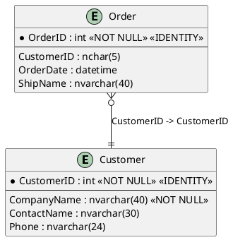

# SQL Server to PlantUML

A .NET tool that generates PlantUML entity relationship diagrams from SQL Server databases.

## Features

- 🔗 **Multiple Connection Methods**: Support for SQL Server, Azure SQL Database with Managed Identity
- 📊 **Two Diagram Types**: Entity relationship diagrams and class diagrams
- 🎛️ **Flexible Configuration**: Command-line options and JSON configuration files
- 🔍 **Smart Filtering**: Include/exclude schemas, tables with regex patterns and wildcards
- 🎨 **Customizable Output**: Themes, custom directives, and styling options
- 🚀 **High Performance**: Async operations with cancellation support
- 📝 **Rich Metadata**: Includes descriptions, data types, indexes, and relationships
- ✅ **Input Validation**: File extension validation and automatic directory creation
- 🛠️ **Robust Error Handling**: Comprehensive logging and error reporting

## Installation

Install as a .NET global tool:

```bash
dotnet tool install --global sqlserver2puml
```

Or install from source:

```bash
git clone https://github.com/pregress/sqlserver2puml.git
cd src
dotnet pack -c Release
dotnet tool install --global --add-source ./bin/release sqlserver2puml
sqlserver2puml -h
```

Or Run from source:

```bash
git clone https://github.com/pregress/sqlserver2puml.git
cd src
dotnet run -- -h
```

## Usage

### Basic Usage

```bash
# Generate entity relationship diagram
sqlserver2puml -c "Server=localhost;Database=Northwind;Integrated Security=true;" -o northwind.puml

# Generate class diagram
sqlserver2puml -c "Server=localhost;Database=Northwind;Integrated Security=true;" -o northwind.puml --type class
```

### Azure SQL Database with Managed Identity

```bash
sqlserver2puml -c "Server=myserver.database.windows.net;Database=MyDatabase;Authentication=Active Directory Default;" -o diagram.puml
```

### Advanced Options

```bash
# Include only specific schemas
sqlserver2puml -c "connection_string" -o output.puml --include-schemas dbo,sales

# Exclude system schemas and limit tables
sqlserver2puml -c "connection_string" -o output.puml --exclude-schemas sys,guest --max-tables 50

# Exclude specific tables (supports wildcards)
sqlserver2puml -c "connection_string" -o output.puml --exclude-tables "*temp*,__*,sysdiagrams"

# Use configuration file
sqlserver2puml -c "connection_string" -o output.puml --config my-config.json

# Include indexes and use a theme
sqlserver2puml -c "connection_string" -o output.puml --include-indexes --theme aws-orange
```

## Configuration File

Create a JSON configuration file for advanced options:

```json
{
  "includeDescriptions": true,
  "includeDataTypes": true,
  "includeIndexes": false,
  "includeRelationships": true,
  "maxTables": 0,
  "includeSchemas": ["dbo", "sales"],
  "excludeSchemas": ["sys", "INFORMATION_SCHEMA"],
  "excludeTables": ["*temp*", "__*", "sysdiagrams"],
  "includeTablePatterns": ["^Product.*", "^Customer.*"],
  "excludeTablePatterns": ["^temp_.*", ".*_backup$"],
  "theme": "aws-orange",
  "customDirectives": [
    "skinparam linetype ortho",
    "skinparam roundcorner 5",
    "skinparam class {",
    "    BackgroundColor LightYellow",
    "    BorderColor DarkGreen",
    "}"
  ]
}
```

## Command Line Options

| Option | Short | Description | Default |
|--------|-------|-------------|---------|
| `--connection-string` | `-c` | SQL Server connection string | Required |
| `--output` | `-o` | Output file path | Required |
| `--type` | `-t` | Diagram type (entity/class) | entity |
| `--config` | `-cfg` | Configuration file path | None |
| `--include-schemas` | | Schemas to include | All |
| `--exclude-schemas` | | Schemas to exclude | sys, INFORMATION_SCHEMA |
| `--exclude-tables` | | Table names to exclude (supports wildcards) | None |
| `--max-tables` | | Maximum tables to include | 0 (unlimited) |
| `--include-data-types` | | Include column data types | true |
| `--include-relationships` | | Include FK relationships | true |
| `--include-indexes` | | Include indexes | false |
| `--theme` | | PlantUML theme | None |
| `--verbose` | `-v` | Enable verbose logging | false |

## Connection String Examples

### SQL Server with Windows Authentication
```
Server=localhost;Database=MyDatabase;Integrated Security=true;
```

### SQL Server with SQL Authentication
```
Server=localhost;Database=MyDatabase;User Id=myuser;Password=mypassword;
```

### Azure SQL Database with Managed Identity
```
Server=myserver.database.windows.net;Database=MyDatabase;Authentication=Active Directory Default;
```

### Azure SQL Database with Service Principal
```
Server=myserver.database.windows.net;Database=MyDatabase;Authentication=Active Directory Service Principal;User Id=app-id;Password=client-secret;
```

## Output Examples

### Entity Relationship Diagram


## Supported SQL Server Versions

- SQL Server 2012 and later
- Azure SQL Database
- Azure SQL Managed Instance

## Authentication Methods

- Windows Authentication (Integrated Security)
- SQL Server Authentication
- Azure Active Directory Authentication
- Managed Identity (Azure-hosted applications)
- Service Principal (CI/CD scenarios)

## PlantUML Themes

You can use any PlantUML theme:
- `aws-orange`
- `blueprint`
- `carbon-gray`
- `cerulean`
- `cerulean-outline`
- `crt-amber`
- `crt-green`
- `hacker`
- `mars`
- `materia`
- `materia-outline`
- `metal`
- `mimeograph`
- `plain`
- `reddress-darkblue`
- `reddress-darkgreen`
- `reddress-darkorange`
- `reddress-darkred`
- `reddress-lightblue`
- `reddress-lightgreen`
- `reddress-lightorange`
- `reddress-lightred`
- `sketchy`
- `sketchy-outline`
- `spacelab`
- `toy`
- `united`
- `vibrant`

Samples: [https://plantuml.com/theme-gallery](https://plantuml.com/theme-gallery)

## Security Best Practices

- Use Managed Identity when running in Azure
- Never hardcode credentials in source code
- Use least privilege database permissions
- Enable SSL/TLS encryption for database connections

## Troubleshooting

### Common Issues

1. **Invalid File Extension**: Output file must have a PlantUML extension
   ```bash
   # ✅ Valid extensions
   sqlserver2puml -c "connection_string" -o diagram.puml
   sqlserver2puml -c "connection_string" -o diagram.plantuml
   sqlserver2puml -c "connection_string" -o diagram.pu
   
   # ❌ Invalid extension
   sqlserver2puml -c "connection_string" -o diagram.txt
   ```

2. **Connection Timeout**: Increase connection timeout in connection string
   ```
   Server=localhost;Database=MyDB;Connection Timeout=60;
   ```

3. **Permission Denied**: Ensure the user has read permissions on system tables:
   ```sql
   GRANT VIEW DEFINITION TO [username];
   GRANT SELECT ON INFORMATION_SCHEMA.TABLES TO [username];
   GRANT SELECT ON INFORMATION_SCHEMA.COLUMNS TO [username];
   ```

4. **Azure SQL Authentication**: For Managed Identity, ensure the identity is added to the database:
   ```sql
   CREATE USER [managed-identity-name] FROM EXTERNAL PROVIDER;
   ALTER ROLE db_datareader ADD MEMBER [managed-identity-name];
   ```

### Debug Mode

Enable verbose logging for troubleshooting:
```bash
sqlserver2puml -c "connection_string" -o output.puml --verbose
```

## License

MIT License - see LICENSE file for details.

## Contributing

1. Fork the repository
2. Create a feature branch
3. Commit your changes
4. Push to the branch
5. Create a Pull Request

## Support

For issues and questions:
- Create an issue on GitHub
